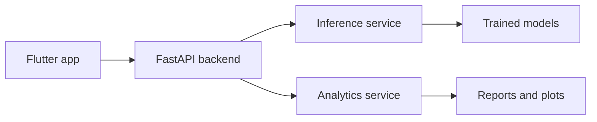

# WeatherSense AI

WeatherSense is a production-oriented Flutter + FastAPI project that combines live weather data with ML-assisted forecasting and analytics.

## Project Structure

- **backend/**: FastAPI service, inference logic, preprocessing, training, and analytics modules.
- **frontend/**: Flutter mobile app UI wired to the backend endpoints.
- **data/**: Historical dataset and processed artifacts.
- **models/**: Trained model files and selection metadata.
- **reports/ and plots/**: Generated analytics artifacts.

## Installation & Setup

### 1. Backend Setup (FastAPI)

1. Navigate to the backend directory:
   ```bash
   cd backend
   ```
2. Ensure you have Python 3.10+ installed. Install dependencies:
   ```bash
   pip install -r requirements.txt
   ```
3. Configure environment variables:
   - Create a `.env` file in the `backend/` directory (refer to `.env.example`).
   - Add `OPENWEATHER_API_KEY=your_key_here` to the file.
   - (Optional) Set `ADMIN_KEY` for protected training routes.
4. Start the API:
   ```bash
   uvicorn app.main:app --reload --host 0.0.0.0 --port 8000
   ```
   The API will be available at `http://127.0.0.1:8000`.

### 2. Frontend Setup (Flutter)

1. Navigate to the frontend directory:
   ```bash
   cd frontend
   ```
2. Install dependencies:
   ```bash
   flutter pub get
   ```
3. Run the app:
   ```bash
   flutter run
   ```

## Android Build Instructions

### Prerequisites
- **Android SDK**: Ensure SDK 34+ is installed.
- **Java**: Recommended JDK 17 or 21. (Note: JDK 25 is currently too new for the bundled Kotlin/Gradle version).
- **Command-line Tools**: If missing, install via Android Studio:
  - `Settings > Languages & Frameworks > Android SDK > SDK Tools > Android SDK Command-line Tools (latest)`.

### Build Commands
- **Debug APK**: `flutter build apk --debug`
- **Release APK**: `flutter build apk --release`
- **App Bundle**: `flutter build appbundle`

> [!NOTE]
> For production deployment, you must configure a signing key in `android/key.properties` and update `android/app/build.gradle`. Currently, the release build uses the debug signing configuration for convenience.

## API Configuration

The app automatically detects the platform and switches the API base URL:
- **Android Emulator**: `http://10.0.2.2:8000`
- **Web / Desktop / Physical Device**: `http://127.0.0.1:8000` (Update to your local IP for physical devices).

Configuration is handled in `lib/services/api_service.dart`.

## ML Workflow

Preprocessing and training modules live in `backend/ml/`.
- Preprocess data: `python -m backend.ml.preprocessing`
- Generate analytics: `python -m backend.ml.analytics`

## Known Issues
- **JDK 25 Compatibility**: The project uses Groovy Gradle files to maximize compatibility, but JDK 25 is still too new for Gradle 8.10. Use JDK 17 or 21 for building Android artifacts.
- **Fonts**: Local font files were replaced with `google_fonts` to ensure production stability without large binary assets.

## Architecture


